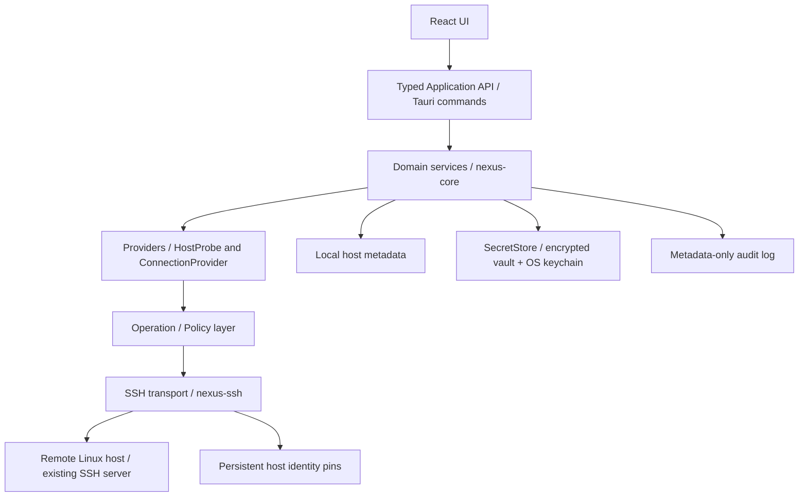

# Architecture

NexusOps separates transport-independent domain data, application orchestration, infrastructure probes and the desktop adapter. Rust is the source of truth for the wire model. `export_protocol` produces the checked-in TypeScript declarations; CI rejects drift. Components consume the typed application client, not `invoke` directly. The only registered IPC commands concern host CRUD, connect/disconnect/reconnect, session status, explicit trust and refresh.

The diagram shows execution flow, not Cargo dependency direction. `nexus-core` composes concrete providers. `nexus-operations` defines `RemoteSession`, so SSH can implement the transport boundary without depending on the orchestrator. Discovery depends on this operation boundary and the domain model; neither depends on Tauri. `ConnectionProvider` is the narrow transport creation extension point in core. The host connection DTO currently describes SSH; future transports should introduce a tagged connection configuration with migrations when an actual second provider exists.

## Connection lifecycle

1. Under a short metadata gate, load the host, reject conflicting lifecycle work, clear obsolete discovery and increment the host's session generation.
2. Retrieve the immutable credential revision on a blocking worker. Secret fields never enter a session or serializable model.
3. Resolve DNS, establish bounded TCP/SSH handshake and check the presented host key before authentication. Unknown hosts return an observed challenge and close the socket. Trusted hosts proceed. A changed key always blocks.
4. Explicit trust must match the application's current pending challenge. The known-host database uses an immediate transaction; only absent or identical pins succeed. Trust never overwrites an existing fingerprint. A second connection verifies the server again.
5. Authenticate, then run the operation engine's fixed read-only probes. Optional failures are safe warnings. Successful data is published only if the session generation still matches.
6. Disconnect cancels the host token, invalidates the generation and closes its transport. Lifetime guards also close I/O if a connection future is dropped. Each host owns its own token, mutable view and transport.

Discovery results are cleared at the start of a connection and on disconnect. Refresh is serialized per host and cannot republish data after disconnect or edit. Polling exposes remote closure to the UI. Keepalives detect an unresponsive peer; a stale discovery observation is always timestamped.

## Local data

Each OS app-data profile contains `hosts.db`, `known-hosts.db`, `credentials.db`, `profile.lock`, `audit.jsonl` and structured application logs. Metadata uses SQLite schema version 1 and rejects newer schemas. Passwords, keys and passphrases are absent from the metadata schema. The vault stores only AES-256-GCM ciphertext with random nonces, bound to a credential revision ID using authenticated associated data. Its master key is a 32-byte OS secure-store entry, avoiding Windows credential blob size limits for large private keys.

A new credential revision is written before metadata commits its reference. Old revisions are removed afterwards. A crash can leave encrypted orphan records; it cannot commit metadata pointing at an unwritten secret. Cleanup failures are surfaced. A process file lock prevents multiple NexusOps instances from racing master-key creation or state writes in one profile.

The first vault write commits a durable initialization marker with its ciphertext. Key reads are read-only, and an initialized vault refuses to generate another master key if its OS entry disappears. The marker survives deleting the last credential. Connection and refresh cancellations produce explicit canceled audit outcomes while generation checks keep late results out of host state.

Audit events contain host ID, UTC timestamp, operation identity and risk, actor, outcome and elapsed duration. The log rotates at 4 MiB with one backup. Application logs are structured JSON, rotate daily with seven files, and disable third-party debug output. No raw command output enters either log.

## Frontend state and extension points

TanStack Query owns host metadata/session snapshots. Zustand owns selection only. Credentials remain in uncontrolled form controls and one short-lived IPC payload; save bypasses mutation caches. Components are grouped into shell, hosts, connection and overview concerns. CSS tokens and primitives permit future light themes; only the dark theme is shipped.

Capabilities use a validated registry and observed facts. Future service/container providers can add capability identifiers without changing SSH. The operation engine currently accepts only its private fixed-command plans with `ReadOnly` risk, supports validation and verification, and reports rollback as unnecessary. Mutating operations must add their own plans, verification and compensating actions, plus policy approvals and audit before any execution API is exposed.

See the [ADRs](../adr/0001-workspace-and-boundaries.md) for decisions and the [threat model](../security/threat-model.md) for boundaries that remain outside this goal.
