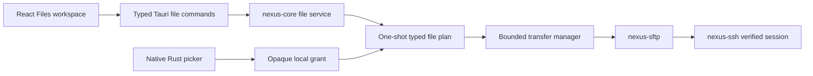

# SFTP files architecture

Goal 02B adds an agentless file workspace over a real SFTP v3 subsystem on the already authenticated and host-key-verified SSH transport. Goal 02C adds a bounded text editor on the same session; see [Remote text editor](editor.md). Neither uses a PTY, shell commands, SCP, or a second login. Failure to open SFTP is scoped to that subsystem; discovery and terminals can remain usable.

## Identity and approval

Every subsystem and returned listing is bound to `HostId + HostSessionId + SftpSessionId`. Concurrent opens for one connection share a per-host startup gate, and publication rechecks the current SSH generation. Reconnect creates a different connection identity. Rust rejects stale IDs and revokes pending plans and local grants for a disconnected session. A picker returns only an opaque, typed, ten-minute grant plus display metadata. The grant itself is scoped to the exact host, SSH connection and SFTP subsystem. Planning consumes it once and records exact local/remote sources, destinations, observed identities, per-item destination action, conflict preference, operation kind, risk, and a five-minute expiry. Execution consumes the immutable plan once. Closing or cancelling approval discards only the named plans. Per-record expiry tasks remove abandoned grants and plans while the app is otherwise idle. Consume and discard share one mutex: whichever removes the record first owns the result, so discard cannot close a resource already transferred into an active operation. A compromised renderer can still invoke allowed commands and display a false prompt, so this lifecycle is policy enforcement rather than cryptographic proof of human intent.

Upload selection opens each approved regular file immediately and retains that handle through planning and transfer. On Windows the handle denies write and delete sharing, which blocks ordinary path replacement while selected. Object identity comes from the open handle as the volume serial plus the complete 128-bit `FILE_ID_INFO` identifier. Unix uses device plus inode. Size and modified time remain separate mutable transfer preconditions, and a filesystem that cannot provide the strong handle identity fails closed. Execution reads a clone of the selected handle and compares both the path-to-handle identity and mutable preconditions before and after streaming. Download selection retains a handle for the approved directory, validates every ancestor against symlink/reparse traversal, and revalidates the directory object identity before temporary-file creation and finalization. The temporary file's original handle is streamed directly and is never closed and reopened by name. The approval text is generated from the immutable plan and shows the safely escaped full local directory and actual final filename, including a Keep both suffix. The path is not logged or published as evidence. These controls do not isolate NexusOps from the logged-in account, a malicious filesystem driver, or an administrator.

The existing `nexus-operations` engine remains restricted to private fixed `ReadOnlyCommand` plans. File writes use the adjacent `FilePlanStore`; no discovery write is mislabeled as read-only. Transfer acceptance is audited as `file.transfer.accepted`. Completion stays in the transient job state, so an accepted asynchronous transfer is never audited as already completed.

## Protocol and limits

`russh-sftp` 3.0.0 supplies the SFTP implementation and accepts the existing russh channel stream. NexusOps requires protocol version 3, records all advertised extension versions, queries `limits@openssh.com` v1 when advertised, and records the returned packet/read/write/open-handle limits. The client packet ceiling is 256 KiB. Payload chunks are capped at 64 KiB even when the server allows more; four reads or writes can be in flight inside the library. Individual SFTP requests have a 15-second timeout. Initialization, subsystem acknowledgement, and channel close are separately bounded.

Directory results contain at most 5,000 validated children. The UI labels a capped result partial, and its sorting/filtering applies only to loaded entries. Remote child names are rejected if empty, traversal-like, absolute, slash-containing, NUL-containing, or longer than 255 UTF-8 bytes. Operational POSIX names remain unchanged. Display text escapes control and bidi controls. Metadata is optional and unknown values remain unknown. Directory handles close on success, cap, cancellation, malformed entries, and ordinary protocol errors.

The transfer manager atomically admits a whole batch or rejects it before any job is inserted or spawned. It admits at most 100 nonterminal jobs, runs at most four globally and two per host, keeps at most 100 terminal history entries, and serializes jobs with the same destination. Local destination serialization keys use the immutable directory object identity and final filename, so aliases to one object serialize together while distinct directories remain independent. Jobs and ordering share one state mutex, and no blocking state lock is held across I/O. Destination lock entries are removed after the last waiter. A terminal history record contains display and outcome metadata only; the task and record release selected file/directory handles before the terminal state becomes visible. A transfer holds neither the global SSH handle mutex nor React component state for its lifetime. UI transfer polling carries metadata only; ordinary upload/download payload bytes remain between Rust local I/O and SFTP. The Goal 02C text editor is the narrow, bounded exception described in [editor.md](editor.md). Rust counters use checked `u64`, while generated TypeScript uses decimal strings and the UI uses `BigInt`.

## Staging and conflicts

Uploads create a job-specific `.nexusops-<uuid>.part` regular file in the destination directory with mode `0600`, stream and optionally `fsync@openssh.com`, close the handle, revalidate the source and final target, then commit. The client confirms staging ownership only after the exclusive `OPEN` reply. A guard removes that exact path after known-owned failures and caller cancellation/drop. A refused create does not trigger removal, and a lost create reply leaves the path untouched because ownership is unknown. There is no wildcard cleanup.

The batch conflict policy is only a preference used during planning. Each item receives `CreateNew`, `ReplaceExisting(expected identity)`, or `Skip`. `CreateNew` always uses a no-clobber primitive, even when the batch preference was Replace. Safe no-clobber and Keep both require `hardlink@openssh.com` v1; hard-link creation is the remote no-clobber commit point. Safe remote Replace requires an approved existing regular file and `posix-rename@openssh.com` v1. The old destination is not deleted first. New files retain mode `0600`; Replace creates a new inode and does not promise preservation of ownership, ACLs, xattrs, timestamps, or hard-link relationships. SFTP v3 does not provide a universal compare-and-swap for replacing an existing file, so final metadata revalidation reduces but cannot eliminate a race with another remote writer.

Downloads create a unique OS-owned temporary file in the selected destination directory, retain and stream through its original handle, flush it, revalidate the remote source, local directory and destination, then use `persist_noclobber` or the platform replacement primitive selected by the item's approved action. The destination directory, its ancestry and final destination must be ordinary non-reparse objects at each check. Windows-invalid device names, ADS syntax, separators, controls, and trailing-dot/space aliases are rejected rather than sanitized. The picker supplies the directory and the file name comes only from the validated remote entry. Windows filesystem lookups catch case-insensitive existing-name collisions; final no-clobber remains authoritative.

Stat/revalidation is not a universal compare-and-swap guarantee against a malicious server, filesystem driver, or another local/remote writer. A normal directory can also be replaced in a narrow interval between validation and an OS operation. Unique exclusive staging, non-following metadata, destination serialization, no-clobber commit primitives, and never deleting the old destination first constrain the impact of those races.

Skip marks only entries that conflicted when the plan was made; nonconflicting entries in a Skip batch still transfer. Keep both searches at most 1,000 candidates and finalizes no-clobber, so a name that appears after planning becomes a conflict. Replace is unavailable when the required extension or target contract is absent. Rename is same-directory and no-overwrite. On SFTP v3/OpenSSH it is enabled for regular files with `hardlink@openssh.com`; directory and symlink rename are disabled because the negotiated primitives do not provide the required no-clobber contract. Delete uses non-following metadata, removes regular files or the symlink itself, and uses non-recursive `rmdir`, which rejects nonempty directories. Special files are not transferred or deleted.

## Cancellation and failure

Cancellation changes `Queued`, `Preparing`, or `Transferring` to `CancelRequested`. A queued cancellation acquires no transfer permit and starts no remote I/O. The job becomes `Cancelled` only after streaming stops and local handles are released; a request observed before finalization removes that job's staging, while a request during finalization does not overwrite a confirmed completion. Disconnect and shutdown cancel active jobs and close the subsystem. Reconnect never resumes them. Terminal transfer rows cannot retain or reconstruct local authority. Retrying requires a fresh explicit picker selection and a new plan; the generic backend retry endpoint refuses terminal transfers, including `OutcomeUnknown`.

A failed request before the commit point removes only a staging path whose exclusive creation was confirmed for that job. A lost reply after create, delete, rename, replacement, or final-file creation produces `OutcomeUnknown`; NexusOps does not blindly replay it. Backend retry rejects all terminal transfer records because their local authority has been released. The user can prepare the operation again only through a new picker grant and current source, destination and session checks. A process crash or create reply with unknown outcome can leave a uniquely named staging file. Restart does not restore jobs or delete unfamiliar `.part` files. An operator may inspect and remove a confirmed orphan manually.

SFTP success confirms protocol acknowledgements and handle closure. The OpenSSH test independently reads the round-tripped bytes, but the product does not run a remote hash command and does not claim crash durability, universal rollback, or preservation of all filesystem metadata.
