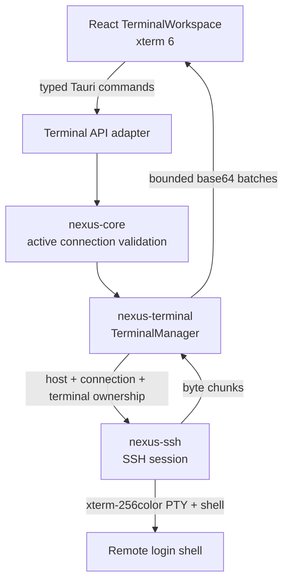

# Terminal architecture

The Remote Terminal is a dedicated typed subsystem. It does not expose the operation engine's fixed probes or a general `ssh_exec(command)` endpoint to React. Opening a terminal authorizes one interactive PTY; subsequent calls can only stream bytes, resize, rename, poll, or close that PTY.

## Ownership and lifecycle

Every terminal is bound to a `(HostId, HostSessionId, TerminalSessionId)` tuple. `HostSessionId` is generated after each successful SSH authentication. Core validates that it is still the host's current connected transport, and the terminal manager validates all three identifiers before input, resize, rename, poll, or close. A terminal ID alone cannot select a channel.

The state model is `creating`, `open`, `closing`, `closed`, `failed`, and `disconnected`. PTY creation has a ten-second deadline. An explicit user close rejects further input, cancels the output pump, sends EOF/close with a two-second bound, intentionally discards queued output, and releases the channel. Remote completion is distinct: the session may enter an ended state while queued bytes remain, and `outputDrained` becomes true only after polling has delivered every queued byte. Duplicate close is idempotent through a bounded 64-entry tombstone list. Closing one tab does not affect sibling PTYs.

A host disconnect cancels every terminal created by that connection and marks its visible record disconnected. Reconnect creates a new `HostSessionId`; ended PTYs remain honest ended tabs during that app process and cannot attach to the new SSH transport. Deleting a host closes and removes its terminal records. Editing remains prohibited while connected, so open PTYs cannot race a profile edit. Application shutdown closes all channels and clears terminal state. Terminal sessions, names, contents, and scrollback are memory-only and are absent after restart.

## SSH PTY and byte flow

`nexus-ssh` opens a persistent SSH session channel, requests an `xterm-256color` PTY with columns, rows, and available device-pixel dimensions, waits for the server's positive response, then requests the account's normal login shell. It does not assume Bash or emulate interaction with repeated command execution. Startup data received before request confirmation is retained. PTY and shell acknowledgement share one aggregate 64 KiB startup-output budget; exceeding it fails startup and closes the partial channel without logging its bytes.

Input is a byte stream. xterm's text and binary callbacks feed `Uint8Array` chunks; the UI batches briefly and limits each typed IPC payload to 16 KiB. Rust decodes bounded base64 and writes the bytes without line-ending conversion. Output remains bytes through SSH and Rust, is split into at most 16 KiB chunks, encoded only for typed IPC transport, decoded to `Uint8Array`, and handed to xterm's incremental parser. Split UTF-8 code points and ANSI sequences therefore remain intact.

Each terminal output queue has 64 slots of at most 16 KiB, about 1 MiB worst-case queued payload. The pump awaits a free slot rather than allocating an unbounded queue. Backpressure reaches russh's 64 KiB SSH receive window when the renderer falls behind. A poll returns at most 64 KiB. The renderer does not request another batch until xterm invokes the write callback for every byte in the current batch; cancellation releases a poll waiting on a stalled emulator. xterm keeps 10,000 scrollback lines.

Aggregate queued terminal input is limited to 256 KiB, including the in-flight 16 KiB chunk. Admission is all-or-nothing for each xterm input event: when the queue is full, the new event is rejected with a visible error instead of being truncated. Accepted chunks retain byte order, and closing the pane cancels queued delivery.

`ResizeObserver` fits the emulator to the visible panel. An 80 ms debounce coalesces changes and sends columns, rows, device-pixel width, and device-pixel height through the ownership-checked resize API. Hidden host workspaces do not send resize storms. OpenSSH validation checks the remote result with `stty size`.

## Workspace and shortcuts

Each host keeps its own mounted workspace while the process is running, so switching hosts preserves the corresponding xterm instances and local scrollback. Tabs open independent PTYs and support switch, local rename, and close. Arrow Left and Arrow Right move among focused tabs.

Application-owned terminal shortcuts are:

| Shortcut | Action |
| --- | --- |
| `Ctrl+Shift+C` | Copy the current selection |
| `Ctrl+Shift+V` | Paste clipboard text |
| `Ctrl+Shift+F` | Open local scrollback search |
| `Ctrl+Shift+K` | Clear the visible terminal |
| `Ctrl+Shift+T` | Open another terminal |
| `Ctrl+Shift+W` | Close the active terminal |

All other terminal key events, including `Ctrl+C`, `Ctrl+D`, `Ctrl+Z`, `Ctrl+L`, `Ctrl+R`, Tab, Shift+Tab, navigation keys, Escape, function keys, and Alt combinations, remain available to xterm and the remote application. The restrained context menu contains Copy, Paste, Select all, Clear, and Search.

Search is implemented by xterm's SearchAddon against local scrollback. Search terms never cross IPC or reach SSH. Clipboard access uses the Tauri clipboard plugin with only `read-text` and `write-text` permissions. Reads and writes happen only after the user selects Copy or Paste; focus changes never inspect the clipboard. Clipboard content is not logged or persisted.

## Sensitive data and diagnostics

Terminal input and output can contain secrets. NexusOps stores neither, sends neither to audit, excludes both from structured logs and errors, and does not place either in React state, Query, Zustand, browser storage, crash reports, analytics, or AI features. xterm owns its memory-only screen and scrollback. Logs contain terminal and host identifiers plus safe stages or error categories.

The renderer still necessarily receives active terminal bytes and clipboard text selected by the user. A compromised renderer, debugger, local account, remote shell history, system clipboard manager, or memory dump can observe them. The production CSP, bundled-only navigation, narrow IPC capability, React text rendering, and Tauri prototype freezing remain enabled. xterm 6 has one compiled namespace assignment incompatible with a frozen `Object.prototype`; the Vite build changes that single pinned assignment to `Object.defineProperty` and fails if the expected construct changes.

## Current limits

- Eight creating/open terminals per host; ended tabs do not consume the limit.
- A caller cancellation or ten-second startup timeout marks the inserted session coherently and releases its capacity; the eight-session limit is unchanged.
- No PTY resume. tmux or another remote persistent-session tool remains a user-managed remote concern.
- No persisted tab names, scrollback, local input history, transcript export, terminal sharing, SSH agent forwarding, jump hosts, or remote file clipboard.
- `TERM` is `xterm-256color`; `COLORTERM` is not asserted. xterm naturally handles true-color sequences, but this milestone claims tested ANSI styles and terminal TUI behavior rather than a negotiated TrueColor environment.
- Clipboard support is plain text only. SFTP and remote file editing belong to Goal 02B.
- Accessibility includes named controls, keyboard tabs/actions, visible focus, contrast, ended-state announcements, and xterm screen-reader mode. Terminal screen readers still inherit xterm and platform WebView behavior.
